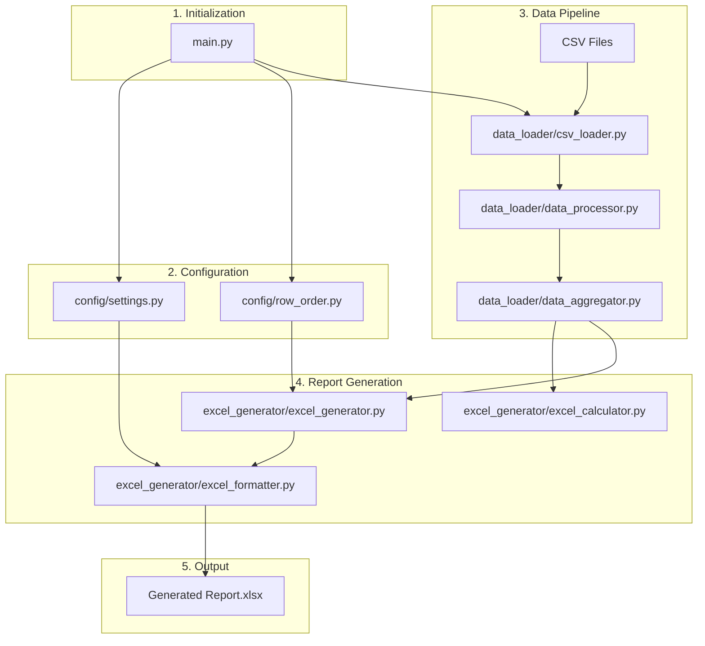

# Report Generator Workflow

This document outlines the step-by-step workflow of the `report_generator` application, from initial data loading to the final Excel report generation.

## 1. Initialization

The process starts at `main.py`. This script acts as the main entry point, determining whether to run the application as a command-line interface (CLI) or a web service based on user arguments.

## 2. Configuration Loading

Regardless of the execution mode, the first step is to load configuration settings from the `config/` directory:

-   **`config/settings.py`**: This file is loaded to get all necessary parameters, such as input data paths, output directory, file encodings, and extensive formatting options for the Excel report (e.g., fonts, colors, borders).
-   **`config/row_order.py`**: This is a critical configuration file that provides the blueprint for the final report. It defines:
    -   The exact order of rows.
    -   The hierarchy (groupings and sub-totals).
    -   The calculation rules for each row (e.g., summing other rows, applying ratios).
    -   Specific formatting overrides for certain rows.

## 3. Data Loading and Processing

The core of the data handling is managed by the `src/data_loader/` module.

1.  **Loading (`csv_loader.py`)**: The `CSVLoader` class reads raw data from the specified CSV files. It is specifically designed to handle various text encodings, including those common in Thai language data.
2.  **Processing (`data_processor.py`)**: The `DataProcessor` takes the raw data and performs several transformations:
    -   **Cleaning**: Handles missing values or incorrect data types.
    -   **Mapping**: Translates raw data categories into the standardized categories defined in the configuration.
    -   **Pivoting**: Transforms the data from a long format (list of transactions) into a wide format (a 2D grid where rows represent financial categories and columns represent months or other periods). This pivoted data is now ready to be placed into the Excel report.
3.  **Aggregation (`data_aggregator.py`)**: This component aggregates the processed data, calculating summaries and totals that will be used in the report.

## 4. Excel Report Generation

This stage is handled by the `src/excel_generator/` module.

1.  **Orchestration (`excel_generator.py`)**: The `ExcelGenerator` class is the main orchestrator. Its `generate_report` method executes the entire report creation process. It iterates through the `ROW_ORDER` blueprint from the configuration.
2.  **Calculation (`excel_calculator.py` & `data_aggregator.py`)**: The `DataAggregator` performs the primary data retrieval and summation based on the report's structure. The `ExcelCalculator` provides helper functions for specific financial formulas (like safe division), which are used by the aggregator.
3.  **Formatting (`excel_formatter.py`)**: As data is written to the worksheet, the `ExcelFormatter` applies all styling rules. This includes setting fonts, cell colors, borders, number formats, and conditional formatting based on the rules defined in `config/settings.py` and `config/row_order.py`. This keeps the presentation logic separate from the data calculation logic.

## 5. Execution

The final report is saved to the designated output directory. The application can be run in two ways:

-   **CLI (`cli/cli.py`)**: A command-line interface for generating reports manually or via scheduled scripts.
-   **Web Service (`web/main.py`)**: A FastAPI-based web service that exposes an API endpoint to trigger report generation.

## Workflow Diagram

---

## Detailed Code Breakdown

### 1. `main.py` (Initialization)
- **Purpose**: Acts as the main entry point and router for the application.
- **How it works**:
    - It uses Python's `argparse` library to read the first command-line argument, which must be either `cli` or `web`.
    - If the mode is `cli`, it passes all subsequent command-line arguments to the `ReportCLI.main()` function in `src/cli/cli.py`.
    - If the mode is `web`, it imports `uvicorn` and the `settings` object from `config.settings`. It then starts the Uvicorn web server, pointing it to the FastAPI `app` object located in `src/web/main.py`.

### 2. Configuration Files (`config/`)
- **`config/settings.py`**:
    - **Purpose**: Defines and manages all configurable aspects of the application.
    - **How it works**: It uses the `pydantic-settings` library to create a `Settings` class. This class defines all configuration variables with default values (e.g., `data_dir`, `output_dir`, `excel_font_name`, `bu_colors`). It can automatically override these defaults with values from a `.env` file or environment variables, making the application flexible for different environments. A single, globally accessible `settings` object is instantiated from this class.

- **`config/row_order.py`**:
    - **Purpose**: Provides the static blueprint for the structure and calculations of the P&L report.
    - **How it works**: The core of this file is the `ROW_ORDER` list. Each element is a tuple `(level, label, is_calculated, formula, is_bold)` that dictates how a single row in the Excel report should look and behave.
        - `level`: Controls the indentation for hierarchical data.
        - `label`: The text that appears in the first column of the row.
        - `is_calculated`: A boolean indicating if the row's values are derived from other rows.
        - `formula`: A string representing the calculation rule (e.g., `"1 - 2"` or `"ebitda"`).
    - This file essentially defines the business logic of the report's structure, keeping it separate from the generation code.

### 3. Data Pipeline (`src/data_loader/`)
- **`csv_loader.py`**:
    - **Purpose**: To reliably load data from CSV files, especially those with Thai characters.
    - **How it works**: The `CSVLoader` class has a `load_csv` method that attempts to read a file using a primary encoding (e.g., `tis-620`). If that fails with a `UnicodeDecodeError`, it automatically retries with a list of fallback encodings (`cp874`, `utf-8`, etc.). The `load_data_files` method finds all relevant CSV files in the data directory that match a specific date pattern.

- **`data_processor.py`**:
    - **Purpose**: To clean and prepare the raw data loaded from CSVs.
    - **How it works**: The `DataProcessor` class takes a raw DataFrame. Its `process_data` method standardizes column names, converts the `VALUE` column to a numeric type, and ensures all categorical columns are strings. It also contains helper methods used by the `ExcelGenerator`, such as `get_unique_business_units` (which respects a predefined order) and `get_period_description` (which creates a formatted string like "สำหรับงวด 9 เดือน...").

- **`data_aggregator.py`**:
    - **Purpose**: To perform all data aggregation and calculations needed for the report. This is the main calculation engine.
    - **How it works**:
        - In its constructor (`__init__`), it takes the processed DataFrame and builds a `self.lookup` dictionary. This is a deeply nested dictionary that acts as a fast, in-memory database, allowing for quick retrieval of aggregated `VALUE`s for any combination of `GROUP`, `SUB_GROUP`, `BU`, and `SERVICE_GROUP`.
        - The `get_value` method queries this lookup structure.
        - The `get_row_data` method is called for each non-calculated row. It uses `get_value` to fetch the data for every column (each BU, each Service Group, etc.) for that specific row.
        - The `calculate_summary_row` method handles complex calculated rows (like "EBITDA" or ratios). It takes the `all_row_data` (a dictionary containing the results of all previous rows) and performs the necessary arithmetic, such as summation or division, across the relevant columns.

### 4. Report Generation (`src/excel_generator/`)
- **`excel_generator.py`**:
    - **Purpose**: To orchestrate the entire Excel file creation process.
    - **How it works**: The `ExcelGenerator` class is the central controller. Its main method, `generate_report`, executes the following steps:
        1. Initializes the `DataAggregator`.
        2. Creates a new `openpyxl` Workbook.
        3. Calls internal methods (`_build_column_structure`, `_build_row_structure`) to define the report's layout based on the data and the `ROW_ORDER` config.
        4. Writes the main headers and the top-right info box.
        5. The most important step is `_write_data_rows`. It iterates through each `row_def` from the `ROW_ORDER` configuration. For each row, it either calls `aggregator.get_row_data()` (for data rows) or `aggregator.calculate_summary_row()` (for calculated rows) to get the values.
        6. It then loops through each column, placing the retrieved value into the correct cell and applying the necessary formatting using the `ExcelFormatter`.
        7. Finally, it writes the remarks at the bottom and saves the file.

- **`excel_calculator.py`**:
    - **Purpose**: To provide a collection of pure, reusable financial calculation functions.
    - **How it works**: This class is a utility library. It contains simple, static methods like `safe_divide` (to prevent division-by-zero errors), `calculate_gross_profit`, and `calculate_ebitda`. These functions are used by the `DataAggregator` when it needs to perform a specific, named calculation. It isolates the mathematical formulas from the data aggregation logic.

- **`excel_formatter.py`**:
    - **Purpose**: To handle all aspects of `openpyxl` styling.
    - **How it works**: This class abstracts away the details of the `openpyxl` styling API. It has factory methods like `create_font`, `create_fill`, and `create_border`. It also has higher-level methods like `apply_data_cell_style` and `apply_header_style` that combine these basic elements into consistent styles. The `ExcelGenerator` calls methods on this class to style cells, set column widths, and apply number formats, ensuring a uniform look and feel without cluttering the generator logic with formatting code.

### 5. Execution Modes
- **`src/cli/cli.py`**:
    - **Purpose**: To provide a command-line interface for the report generator.
    - **How it works**: The `ReportCLI` class uses `argparse` in its `main` method to define and parse command-line arguments like `--data-dir`, `--output-dir`, `--date`, and `--type`. The `generate_report` method then orchestrates the entire workflow: it instantiates and calls the `CSVLoader`, `DataProcessor`, and finally the `ExcelGenerator` to produce the final report file, printing progress and status messages to the console.

- **`src/web/main.py`**:
    - **Purpose**: To set up a FastAPI web service that exposes the report generation functionality via an API.
    - **How it works**: This file initializes the main `FastAPI` application instance. It configures Cross-Origin Resource Sharing (CORS) to allow web browsers to access the API. It defines a simple `/health` check endpoint. Its most important job is to import and include router objects from the `src.web.routes` directory (e.g., `report.router`). These routers contain the actual API endpoint definitions (e.g., a POST request to `/api/report/generate`) that will trigger the report generation process.