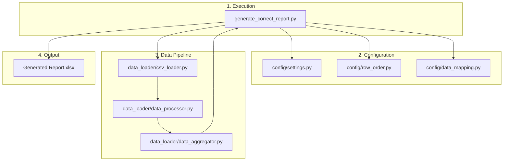

# Report Generator Workflow

This document outlines the step-by-step workflow of the `report_generator` application, focusing on the primary script `generate_correct_report.py` used for creating the final, detailed P&L report.

## 1. Execution Entry Point

The main process is initiated by running the **`generate_correct_report.py`** script. This script acts as the central orchestrator for the entire report generation, overriding and replacing the more generic `ExcelGenerator` module for this specific, complex report format.

While the project contains modules for a generic CLI (`src/cli`) and web (`src/web`) interface, the `generate_correct_report.py` script is the current, definitive method for producing the multi-level P&L report.

## 2. Configuration Loading

The script begins by loading configuration from the `config/` directory, which separates the report's structure and business logic from the generation code:

-   **`config/settings.py`**: Provides global settings like font names and sizes.
-   **`config/row_order.py`**: Defines the precise vertical order of all rows in the report, their indentation levels (`level`), and basic styling (`is_bold`).
-   **`config/data_mapping.py`**: This is a critical file that contains the core business logic:
    -   **`CONTEXTUAL_MAPPING`**: Maps report row labels to the `GROUP` and `SUB_GROUP` categories from the raw data, allowing for context-aware lookups (e.g., mapping the same sub-item label to different data depending on its parent group).
    -   **`CALCULATED_ROWS`**: A dictionary that explicitly defines which rows are calculated (e.g., "EBITDA", "Gross Profit") and maps them to a specific calculation type.

## 3. Data Loading and Aggregation (`src/data_loader/`)

The script then uses the `src/data_loader` modules to prepare the data:

1.  **Loading (`csv_loader.py`)**: The `CSVLoader` class reads the source CSV file, automatically handling various text encodings to prevent errors with Thai characters.
2.  **Processing (`data_processor.py`)**: The `DataProcessor` cleans the loaded data, standardizes types, and extracts essential metadata like the list of unique Business Units (BUs), Service Groups (SGs), and Products.
3.  **Aggregation & Calculation (`data_aggregator.py`)**: This is the application's **main calculation engine**.
    -   It builds a fast, in-memory `lookup` dictionary for rapid data retrieval, including a separate lookup for product-level data.
    -   It provides key methods used by the main script:
        -   `get_row_data()`: Fetches data for standard, non-calculated rows using the context-aware logic from `config/data_mapping.py`.
        -   `calculate_summary_row()`: Performs complex summary calculations (like EBITDA, Net Profit) based on the calculation type defined in `config/data_mapping.py`.
        -   `calculate_product_value()`: A specialized method to calculate values for a specific product within a given row, including for calculated summary rows.
        -   `_calculate_ratio_by_type()`: A private helper method to handle the specific, context-dependent logic for ratio rows.

## 4. Report Orchestration and Generation (`generate_correct_report.py`)

This script is responsible for all orchestration and direct interaction with the `openpyxl` library to build the Excel file.

1.  **Complex Header Construction**: The script programmatically builds a complex, multi-level column header structure:
    -   The first level contains the main Business Unit (BU).
    -   The second level contains the Service Group (SG).
    -   The third and fourth levels contain the Product Key and Product Name.
    -   It also generates "Total" columns for the Grand Total, each BU, and each SG, merging cells as needed to create the correct visual hierarchy.

2.  **Row Iteration and Data Writing**:
    -   The script iterates through the `ROW_ORDER` configuration to build the report row by row.
    -   For each row, it writes the label and then iterates through the `column_mapping` it built during the header construction phase.
    -   It calls the appropriate `DataAggregator` method (`get_row_data`, `calculate_summary_row`, or `calculate_product_value`) to get the value for each specific cell.
    -   **Context Handling**: It tracks the current main group (e.g., "1.รายได้", "2.ต้นทุนบริการและต้นทุนขาย :") and passes this context to the aggregator, ensuring that data lookups are correct. It also has special logic to identify the previous row's label to correctly calculate context-sensitive ratios.

3.  **Styling and Formatting**: All cell styling (fonts, colors, borders, number formats) is applied directly within the `generate_correct_report.py` script using `openpyxl` objects. It uses color codes defined within the script to style BU-related columns.

## 5. Final Output

The final, fully-formatted `.xlsx` file is saved to the `/output` directory.

## Workflow Diagram

